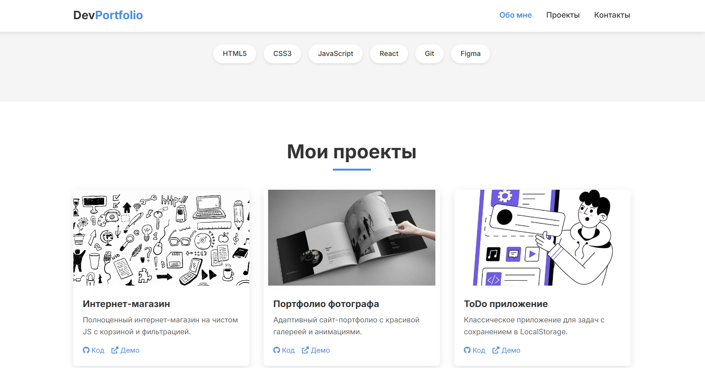
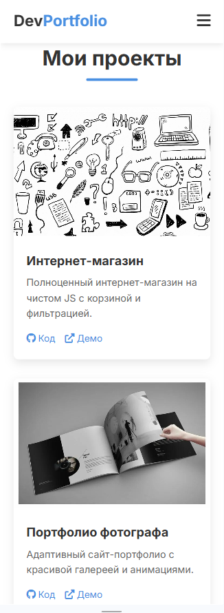

# developer-s_portfolio_demo_Alexey
О проекте
Этот лендинг разработан как демонстрационное портфолио и представляет собой готовый шаблон, который можно:

• Наполнить реальными проектами и контентом
• Адаптировать под корпоративные цвета бренда
• Интегрировать в CMS (1С-Битрикс / WordPress)
• Доработать под конкретные требования заказчика

🛠 Стек технологий
• HTML5 — семантическая верстка
• CSS3 — Flexbox, Grid, переменные, медиазапросы
• JavaScript — навигация, анимации при скролле, мобильное меню
• Google Fonts — шрифт Inter
• GitHub Pages — хостинг

✨ Функциональность
✅ Полностью адаптивный дизан (mobile first)

✅ Плавная навигация по секциям

✅ Анимация появления элементов при скролле

✅ Мобильное бургер-меню

✅ Подсветка активного пункта меню

✅ Готовые секции: "Обо мне", "Проекты", "Контакты"

✅ Оптимизированная производительность

Сайт корректно отображается на всех устройствах:
• Десктоп (1200px+) — сетка из 3 колонок

• Планшеты (768px - 1199px) — сетка из 2 колонок

• Мобильные (до 767px) — одноколоночная верстка, бургер-меню

Структура проекта:
index.html          # Главная страница
style.css           # Все стили проекта
script.js           # JavaScript функционал
images              # Папка с изображениями
screenshots          # Папка со скриншотами
README.md           # Документация

Проект имеет чистую структуру, что упрощает:
• Нарезку на шаблоны WordPress (header.php, footer.php и т.д.)
• Интеграцию в 1С-Битрикс через компоненты
• Добавление PHP-вставок для динамического контента

📄 Лицензия
Проект доступен для свободного использования в образовательных целях и как шаблон для портфолио. При переиспользовании кода ссылка на автора приветствуется.

Если у вас есть вопросы или предложения по сотрудничеству:

Email: liza.lazarewa@yandex.ru
GitHub: hichihitao-blip

